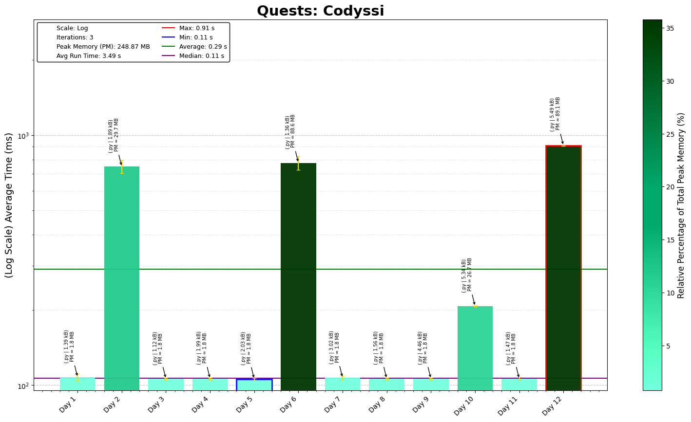

# Codyssi Problems - 2025 Challenges

## Day-by-Day Coding Overview

1. **Problem 1 - Compass Calibration**: Fairly simple arithmetic, although the use of zip to iterate through two lists simultaneously was interesting.
2. **Problem 2 - Absurd Arithmetic**: Sorting through numbers based on a series of arithmetic functions written in text.
3. **Problem 3 - Supplies in Surplus**: Sorting through a series of boxes, and keeping track of its different properties.
4. **Problem 4 - Aeolian Transmissions**: Tracking memory of files and identifying different compression for the file.
5. **Problem 5 - Patron Islands**: Calculating manhattan distances between a series of 2D coordinates.
6. **Problem 6 - Lotus Scramble**: Characterising the data in a file, and calculating its value.
7. **Problem 7 - Siren Disruption**: Reordering a list of numbers based on a seriesss of instructions
8. **Problem 8 - Risky Shortcut**: Reduced string based on properties of surrounding characters.
9. **Problem 9 - Windy Bargain**: Basic accounting, keeping track of cash and balancing the books.
10. **Problem 10 - Cyclops Chaos**: Path finding through agrid, looking for safest path using heapq and basic method.
11. **Problem 11 - Games in a Storm**: Reading numbers from different base and converting them to a target base, plus identifying the min base for any number of a target length.
---
